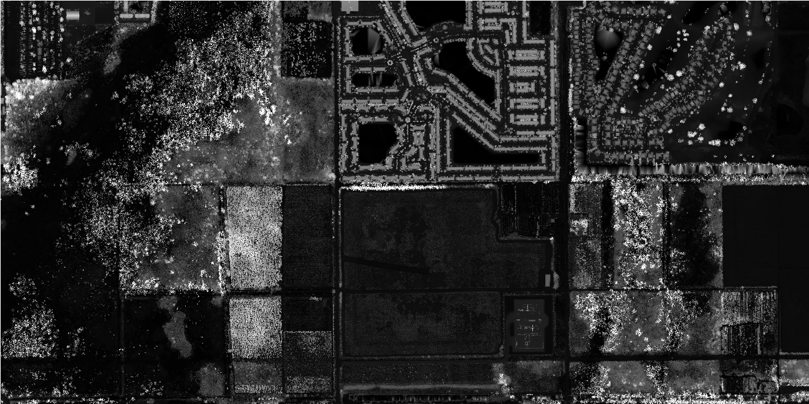

# LiDAR DEM Prep Tool

ArcPy automation workflow for converting raw LAZ LiDAR files into ground-classified bare-earth DEMs in ArcGIS Pro.

## Overview

This script automates a LiDAR preprocessing workflow for terrain analysis. It converts compressed LAZ files to LAS, creates a LAS dataset, classifies ground points, filters to ground-only returns, and generates a DEM with user-defined resolution.

## Workflow

```text
LAZ → LAS → LAS Dataset → Ground Classification → Ground Filter → DEM
```

## Features

- LAZ to LAS conversion
- LAS dataset creation
- automated ground classification
- configurable DEM resolution
- bare-earth DEM generation

## Required license 

- ArcGIS Pro
- ArcPy
- 3D Analyst Extension

## Sample Output

### Bare-Earth DEM Hillshade of Florida Everglades generated from raw LIDAR from USGS


## Author

Matt Berry
